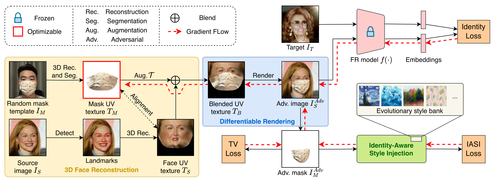
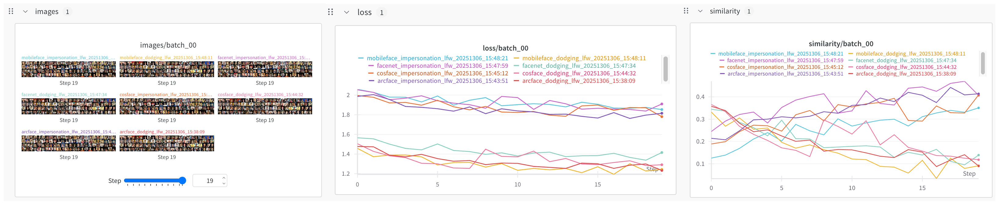

# NatMask

This is the official PyTorch implementation of the paper [Natural Adversarial Mask for Face Identity Protection in Physical World](https://ieeexplore.ieee.org/document/10816466).



## Environment Setup

Clone this repo:

```bash
git clone https://github.com/imxtx/NatMask.git
```

We recommend using [uv](https://docs.astral.sh/uv/), an extremely fast Python package and project manager, to manage your environments:

```bash
cd NatMask
uv venv --python 3.11.11
source .venv/bin/activate
```

*Deprecated and not tested*: You can also use Conda to create an environment. Note that PyTorch no longer supports Conda for installation, so you will need to use pip to install the required packages.

```bash
conda create -n natmask python=3.11.11
conda activate natmask
```

Install PyTorch 2.6:

```bash
uv pip install torch==2.6.0 torchvision==0.21.0 torchaudio==2.6.0 --index-url https://download.pytorch.org/whl/cu126
```

Install PyTorch3D from source:

```bash
uv pip install setuptools
uv pip install "git+https://github.com/facebookresearch/pytorch3d.git@75ebeeaea0908c5527e7b1e305fbc7681382db47" --no-build-isolation
```

If you encounter compilation errors related to the CUDA version, please install the CUDA Toolkit 12.6 first:

(1) Download the run file from [NVIDIA](https://developer.nvidia.com/cuda-12-6-3-download-archive?target_os=Linux)

(2) Install the CUDA Toolkit without sudo by running:

```bash
sh cuda_12.6.3_560.35.05_linux.run --toolkitpath=~/cuda-12.6
```

Be sure to select **ONLY** the CUDA Toolkit 12.6 option during installation. This command will install cuda toolkit to your home directory (you can change it by `--toolkitpath`).

(3) Export the executable and library paths of CUDA Toolkit 12.6:

```bash
export PATH="~/cuda-12.6/bin:${PATH}"
export LD_LIBRARY_PATH="~/cuda-12.6/lib64:${LD_LIBRARY_PATH}"
```

(4) Run the following command, which will take about 10 minutes to compile PyTorch3D:

```bash
uv pip install "git+https://github.com/facebookresearch/pytorch3d.git@75ebeeaea0908c5527e7b1e305fbc7681382db47" --no-build-isolation
```

Install other dependencies:

```bash
uv pip install -r requirements.txt
```

## Data and Model Preparation

### Pretrained Models

You can download pretrained face recognition models and the face 3D reconstruction model from [Google Drive](https://drive.google.com/drive/folders/1ZGJWU13qlaG_ZuEsdTxDvO-UAFNx-f7Z?usp=sharing) and put them in the `pretrained_models` folder. You can run the following commands to check their integrity:

```bash
python models/arcface.py 
python models/cosface.py
python models/facenet.py
python models/mobileface.py
python models/prnet.py
```

You also need to copy `prnet.pth` to `FaceXZoo/FMA-3D/model/`.

### LFW

(1) Download the [lfw-deepfunneled](https://www.kaggle.com/datasets/jessicali9530/lfw-dataset) dataset and unzip it to a folder:

```bash
unzip lfw-deepfunneled.zip
```

Make sure you have the following directory structure:

```text
LFW
├── lfw-deepfunneled
│   ├── Aaron_Eckhart
│   ├── ...
├── ...
├── pairs.csv
└── ...
```

(2) Run the following commands to preprocess it:

```bash
cd FaceXZoo/face_sdk/
python api_usage/face_preprocess_lfw.py \
    --img_dir /path/to/lfw-deepfunneled/containing_name_folders
```

After running this command, you should get cropped face images with their landmarks in each folder like this:

```text
Zurab_Tsereteli
├── Zurab_Tsereteli_0001.jpg
├── Zurab_Tsereteli_0001_cropped.jpg
├── Zurab_Tsereteli_0001_cropped_detect.jpg
├── Zurab_Tsereteli_0001_cropped_detect.txt
├── Zurab_Tsereteli_0001_cropped_landmark.jpg
├── Zurab_Tsereteli_0001_cropped_landmark.txt
├── Zurab_Tsereteli_0001_detect.jpg
├── Zurab_Tsereteli_0001_detect.txt
├── Zurab_Tsereteli_0001_landmark.jpg
└── Zurab_Tsereteli_0001_landmark.txt
```

(3) Generate positive and negative pairs for dodging and impersonation experiments:

```bash
python utils/gen_pairs.py \
    --dataset lfw \
    --root_dir /path/to/the/folder/containing_pairs.csv
```

This command will read the pairs list from `pairs.csv` and create `data/lfw/dodging.txt` and `data/lfw/impersonation.txt`.

### CelebA-HQ

(1) Download the [CelebA-HQ](https://github.com/switchablenorms/CelebAMask-HQ) dataset and unzip it to a folder:

```bash
unzip CelebAMask-HQ.zip
```

(2) Run the following command to resize the images to 256 x 256:

```bash
python utils/resize_celeba_hq.py \
    --input_dir /path/to/CelebAMask-HQ/CelebA-HQ-img \
    --output_dir /path/to/CelebAMask-HQ/CelebA-HQ-img-256
```

(3) Extract landmarks for all face images (256 x 256) as we need to use them to perform face 3D reconstruction and get their textures. First, detect bounding boxes:

```bash
cd FaceXZoo/face_sdk/
python api_usage/face_preprocess_celeba_hq.py \
    --img_dir /path/to/CelebAMask-HQ/CelebA-HQ-img-256
```

After running this command, the `CelebA-HQ-img-256` folder should contain the detected landmarks of each face image like this:

```text
0.jpg
0_detect.jpg
0_detect.txt
0_landmark.jpg
0_landmark.txt
```

(4) Generate positive and negative pairs for dodging and impersonation experiments:

```bash
python utils/gen_pairs.py \
    --dataset celeba_hq \
    --root_dir /path/to/CelebAMask-HQ/CelebA-HQ-img-256
```

This command will read the identity list from `data/celeba_hq/identities.txt` (this file is generated from the original identity labels from the [CelebA](https://mmlab.ie.cuhk.edu.hk/projects/CelebA.html) dataset) and create `data/celeba_hq/dodging.txt` and `data/celeba_hq/impersonation.txt`.

### Style Images

Download the [Best Artworks of All Time](https://www.kaggle.com/datasets/ikarus777/best-artworks-of-all-time) from kaggle, unzip it, and preprocess:

```bash
cd /path/to/NatMask
python utils/preprocess_styles \
    --images /path/to/the/unzipped/folder/resized/resized \
    --save_dir /path/to/save
```

By default, preprocessed style images will be saved to the `data/style_images` folder unless you specify a different directory using the `--save_dir` argument.

### Mask Templates (Optional)

We have preprocessed some mask templates for experiments, available in the `data/masks` folder. You can also create your own mask templates by following these steps:

(1) Place the images of faces wearing masks and their corresponding segmented mask images (you can manually or use pre-trained models like [SAM](https://github.com/facebookresearch/segment-anything) to segment the mask) into two folders: `data/masks/face` and `data/masks/mask`.

(2) Run the following commands to extract facial landmarks:

```bash
cd FaceXZoo/face_sdk/
python api_usage/face_detect_mask.py
python api_usage/face_alignment_mask.py
```

Bounding boxes and landmarks will be saved to `data/masks/bbox` and `data/masks/landmark`, respectively.

(3) Finally, run the following command to generate mask textures:

```bash
cd FaceXZoo/FMA-3D/
python create_mask_textures.py
```

Mask textures will be saved to the `data/masks/texture` folder. You can also modify the relevant paths in these Python scripts as needed.

## Generating Adversarial Masks

Use the following example scripts to generate adversarial face masks (you may need to change some dataset-related paths in the config file):

```bash
python run.py \
    target=arcface \
    attack=dodging \
    n_iter=20 \
    batch_size=32 \
    test_dataset=lfw \
    device=cuda:0
```

or using scripts in the `scripts` folder for one target model:

```bash
bash scripts/run_lfw_arcface_dodging.sh
```

or run in parallel for all models:

```bash
bash scripts/run_lfw.sh
```

All the output will be write to the `results/<dataset>` (image and obj files) and `wandb` (wandb logs) folders.

You can change：

- the `target` argument to generate adversarial masks for a different target model.
- the `attack` argument to experiment under a different setting, i.e., impersonation
- the `test_dataset` argument to experiment on a different dataset.

You can take a look at the `conf` folder to change more hyperparameters to balance the ASR and the naturalness of generated masks.

Note that we use [Hydra](https://hydra.cc/docs/intro/) for configuration management and [wandb](https://wandb.ai/site/) for logging (see the wandb logging example below).



Run the following script to evaluate the generated images:

```bash
bash scripts/eval.sh
```

One can try online demos ([Face++](https://www.faceplusplus.com/face-comparing/), [Tencent](https://cloud.tencent.com/product/facerecognition), [Baidu](https://cloud.baidu.com/product/face/compare)) or use python scripts ([Face++](https://console.faceplusplus.com.cn/documents/6329752), [Tencent](https://github.com/TencentCloud/tencentcloud-sdk-python/blob/master/tencentcloud/iai/v20200303/iai_client.py), [Baidu](https://ai.baidu.com/ai-doc/FACE/Oktmssfse)) to test APIs.

## Acknowledgement

We want to thank the following open-source projects:

- [FaceX-Zoo](https://github.com/JDAI-CV/FaceX-Zoo)
- [PRNet](https://github.com/yfeng95/PRNet)
- [PyTorch3D](https://github.com/facebookresearch/pytorch3d)

We would also like to thank Haomiao Sun, Haozhan Wu, Xin Li, Yewei Zhao, and Peihua Zhang for their contributions to data collection.

The source code and the generated adversarial images are intended for research purposes only.

## Cite

If you find our method useful, please consider citing our work:

```text
@ARTICLE{10816466,
  author={Xie, Tianxin and Han, Hu and Shan, Shiguang and Chen, Xilin},
  journal={IEEE Transactions on Pattern Analysis and Machine Intelligence}, 
  title={Natural Adversarial Mask for Face Identity Protection in Physical World}, 
  year={2025},
  volume={47},
  number={3},
  pages={2089-2106},
  doi={10.1109/TPAMI.2024.3522994}
}
```
